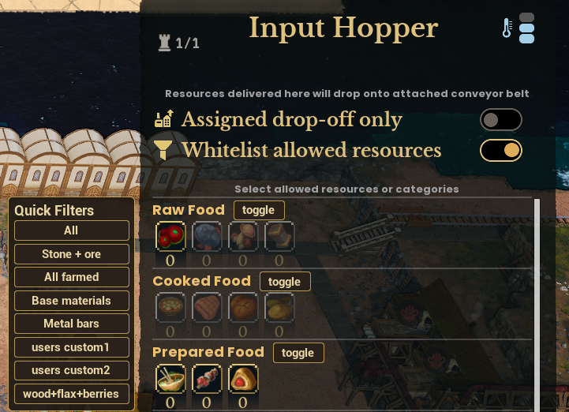

# Conveyor Belt Quick Filters

A quality-of-life mod for [Whiskerwood](https://store.steampowered.com/app/2489330/Whiskerwood/).



The Input Hopper and Filter windows make you click every resource icon one by one. This mod adds:

- a **toggle** button on every category header (Raw Food, Ores, Refined Material, ...): turns the whole category on, or off when all of it is already on;
- a **Quick Filters** list beside the window: *All*, *Stone + ore*, *All farmed*, *Base materials*, *All food*, *Metal bars*, plus **your own filters**. Each one is a toggle too, and leaves every other resource alone.

## Features

- Works in the **Input Hopper** and the **Filter** windows. In the Input Hopper it shows while *Whitelist allowed resources* is switched on (with it off the hopper accepts everything anyway).
- Make your own filters in a text file: single resources, whole categories (`@ore`) or everything (`*`).
- Uses the game's own icon click, so nothing is patched and saves stay normal.
- Settings under **Settings → Mods**: *Quick Filters - category buttons* and *Quick Filters - custom filter list* (both on by default).
- Works while paused, and does nothing in the background: the mod only reacts to your clicks and key presses.

## Installing

- **Steam Workshop:** subscribe.
- **Manually:** put `QuickFilters.pak` and `QuickFilters.uplugin` in `%localappdata%\Whiskerwood\Saved\mods\QuickFilters\`.

## Your own filters

The built-in filters, the format, **every resource id** and **every category key** are in [`docs/QuickFilters-defaults.txt`](docs/QuickFilters-defaults.txt).

1. Create the folder `%localappdata%\Whiskerwood\Saved\mods\QuickFiltersConfig\` (a separate folder, so mod updates don't delete your file).
2. Save a text file **`QuickFilters.txt`** there (watch out for `QuickFilters.txt.txt` when Windows hides extensions).
3. Write your filters under a `[presets]` line and load your save:

```ini
[presets]
Fuel stuff   = coal, fuel, wood
Bars + ore   = @ore, copperbar, ironbar, bronze
Stone + ore  = stone, @ore, coal   ; same name as a built-in: replaces it
All food     =                     ; empty: removes that built-in button
No food      = -@rawFood, @foodTier1   ; leading - : this button only turns things off
```

| Token | Means |
|---|---|
| `stone`, `copperore`, ... | one resource |
| `@rawFood` `@foodTier1` `@preparedFood` `@mealFood` `@tea` | Raw Food, Cooked Food, Prepared Food, High Cuisine, Tea |
| `@raw` `@ore` `@refined` `@tools` `@naval` `@trade` | Raw Material, Ores, Refined Material, Supplies, Naval, Export Goods |
| `*` | every resource |
| `-` at the start of the value | the button only turns the listed resources off |

New names are added at the end of the list. `;` or `#` start a comment; spaces and upper/lower case don't matter. Resources a window doesn't offer are skipped.

## Repository layout

| Path | What |
|---|---|
| `Mod/QuickFilters/` | The mod's source assets (`.uasset`) and `QuickFilters.uplugin`. |
| `docs/graphs/` | Blueprint graphs as copy-paste text (T3D). Reference only: the `.uasset` files are the source of truth. |
| `docs/QuickFilters-defaults.txt` | Built-in filters, format, all resource ids and category keys. |
| `docs/screenshot.png` | Screenshot, also the Workshop preview. |
| `tools/` | `t3d.py`, `qf_common.py`, `quickfilters_build.py` (graph generator), `presets_sim.py` (Python mirror of the config parser, with tests). |
| `workshop/` | SteamCMD item file and [upload steps](workshop/HOW_TO_UPLOAD.md). |
| `sync-from-modkit.bat` / `sync-to-steam.bat` | Copy assets from the modkit + stage the pak / upload to the Workshop. |

## Building from source

1. Set up the [Whiskerwood modkit](https://github.com/Whiskerwood-Modding/Whiskerwood-Project) (UE 5.8).
2. Copy `Mod/QuickFilters/` to `Content/Mods/QuickFilters/`. Pak chunk **28** (`PAL_QuickFilters`).
3. **Cook & Install**; afterwards `sync-from-modkit.bat` copies changed assets back.

Regenerate graphs with `JMAP=path/to/Whiskerwood-x.jmap.gz python tools/quickfilters_build.py` (output in `tools/out/`, with `variables.txt`). In each graph: Ctrl+A, Delete, Ctrl+V, compile.

| Asset | Parent class | Variables / designer |
|---|---|---|
| `BP_Startup` | Actor | none |
| `WBP_HopperHelper` | **UI_AimBoxDetails** | `Hud` (Aim Box Hud Data), `Keys`, `SlotKeys`, `Allowed`, `ItemNames` (Name arrays), `Cats`, `ItemCats` (String arrays), `WlOn` (Boolean) |
| `WBP_SorterHelper` | **UI_Sorter** | same, but `Hud` is Sorter Hud Data |
| `WBP_QuickWaiter` | UserWidget | `Waited` (Float), `Stage` (Integer), event dispatcher `Done` |
| `WBP_QuickButton` | UserWidget | designer: **Button `Btn`** → **Text `Label`** |
| `WBP_CatRow` | UserWidget | designer: **HorizontalBox `Row`** |
| `WBP_QuickPanel` | UserWidget | designer: **Border** (root) → VerticalBox → title Text + **VerticalBox `List`** |
| `BP_MapLoad` | Actor | see `tools/out/variables.txt` |

Paste order: the designer widgets, `WBP_QuickWaiter` (create `Done` first), the helpers, `BP_Startup`, `BP_MapLoad`.

## How it works

- The Input Hopper window is the game's `UI_AimBoxDetails` (`Arcoview_AIM_Box`), the Filter window `UI_Sorter` (`SorterView`). Their private `CalcHudState()` returns the categories, resources and the whitelist (the resources switched on); two invisible helper widgets (child classes of those windows) read it for the open window's building. The Filter window's read has no resource list, so the mod uses the list of the last hopper it read, or the game's `Resources` table.
- Each category is a `ResourceCategoryGroup` (`categoryTitle` + icon grid). The mod moves the title and its toggle into a new row at the same place.
- A resource icon sends the game action `resourceClicked`. The mod sends the same action to the window, once per resource whose state has to change.
- **When the mod runs:** after a key / mouse release, or a click on one of the window's buttons, an invisible widget waits a moment (widget tick, so it works while paused), then the mod looks for an open hopper/filter window. The windows slide in, so the list is shown once the window has stopped moving. Nothing runs between clicks.

## Debug logging

Silent by default. Create `%localappdata%\Whiskerwood\Saved\mods\QuickFiltersConfig\debug.txt` with any text to get log lines in `%localappdata%\Whiskerwood\Saved\Logs\modlog.txt`.

## Known limitations

- After switching *Whitelist allowed resources* on in an open hopper, the list and toggles appear on your next click.
- The game applies the changes through its normal command queue, so the icons update a moment later.

## Version history

- **1.1**: works in a new game too (before, the toggles and the Quick Filters list only appeared after loading a save).
- **1.0**: first release.

## Credits

Created using the Whiskerwood modkit: https://github.com/Whiskerwood-Modding/Whiskerwood-Project
